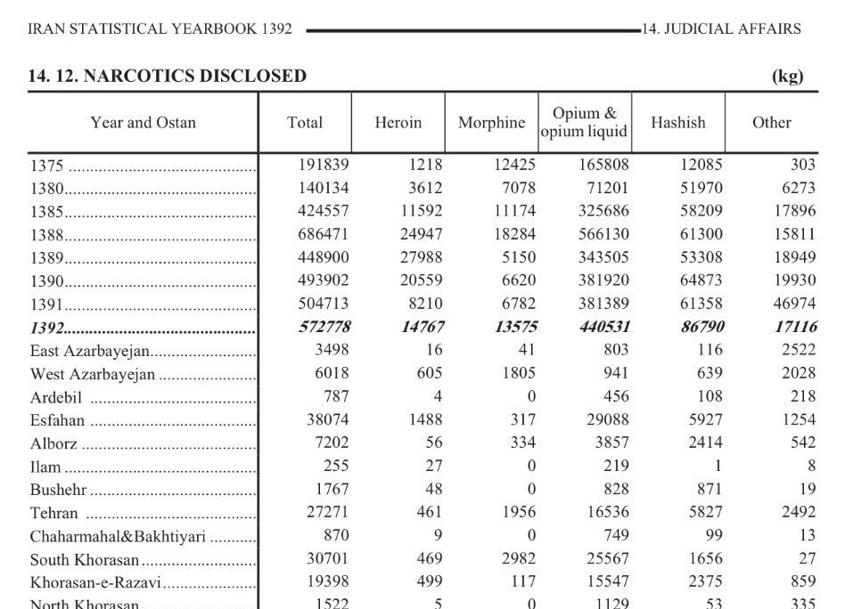

# CSC 544 Assignment 5 (Final Project Report)

**Author**: Bijan Anjavi  
**Date**: December 6, 2017

## Goal

The goal of this project is to analyze narcotics data from Iran using the "data-driven approach" to design a choropleth. This is visualized over an interactive interface. The dataset originates from the Iranian Statistical Yearbook, year 1392 (2013-2014) [[1]](assets/source1_link). The "data-driven approach" method is discussed extensively in "A Survey of Colormaps in Visualization" from VIS 2016 [[2]](assets/source2_link).

### Interactive Visualization Demo

## Extended Abstract

The foundational paper, "A Survey of Colormaps in Visualization," offers a comprehensive analysis of colormaps, emphasizing 1D colormaps over bivariate types. The primary objectives of the paper were to review current colormap generation techniques, classify these techniques, and establish a reference for colormap choices. This project adopts the first goal, emphasizing the creation of a choropleth by considering the dataset at the onset and molding the visualization features around this data.

In the process of this project, a significant transformation was undertaken. The original dataset, represented in the Iranian Statistical Yearbook, was primarily in a table format. While tables are informative, they often do not provide an intuitive grasp of patterns, trends, or anomalies. Recognizing this, the old table visual from the narcotics yearbook was upgraded into a more dynamic, interactive visualization. This modern representation not only offers a more immediate understanding but also allows users to explore the data in depth, focusing on specific regions, time frames, or narcotic types. 

## Implementation Details

The project predominantly uses Javascript, HTML, and CSS. Javascript libraries incorporated include d3, d3-queue, d3-scale-chromatic, and topoJSON. NodeJS played a role in server-side JavaScript execution, a requirement given the integration of topoJSON. The data was manually aggregated from tables found in three PDFs in the assets folder, resulting in a synthesized `narcotics.csv` file containing comprehensive records for each Ostan.

For a hands-on experience, the project can be initiated in a repository running NodeJS, with `index.html` serving as the homepage.

## Future Enhancements

The project realization illuminated potential enhancements that could amplify the depth and utility of the visualization. On the enhancement agenda are:

1. Button issue resolution to permit dynamic choropleth and legend alterations (options include "narcotic", "population", and "unemployment").
2. Incorporation of `c.tile.openstreetmap` to embellish the Iran-Ostan map with neighboring countries, emphasizing the geopolitical significance of the "Golden Crescent" region.
3. Data augmentation to include coordinates of drug rehab centers in Iran, juxtaposing the narcotic crisis magnitude with available medical resources.
4. Temporal data integration for a richer historical perspective, enabled through an interactive slider.
5. Holistic UX/UI improvements for a seamless user experience, potentially through the exploration and integration of additional JavaScript libraries.

